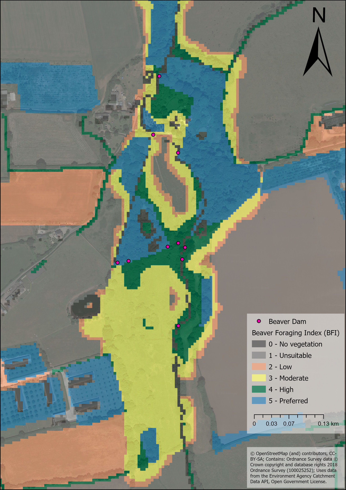
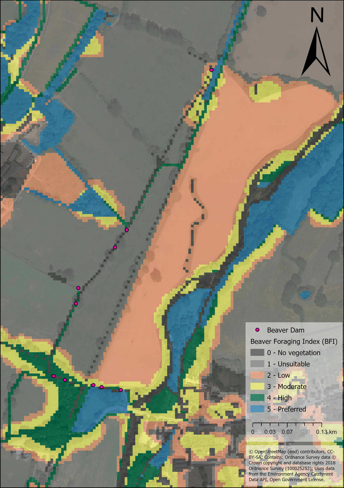
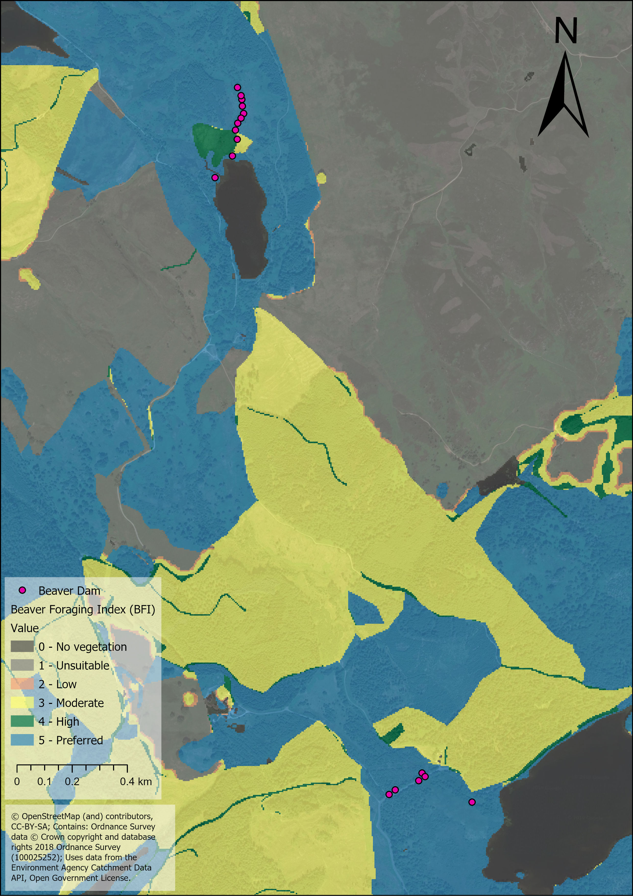
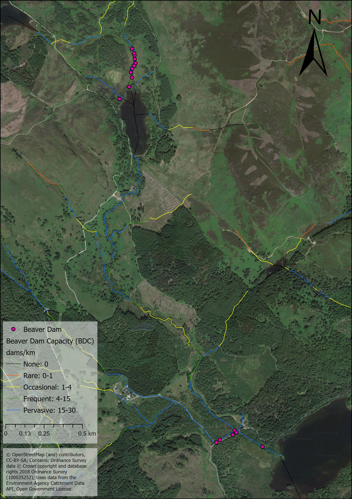
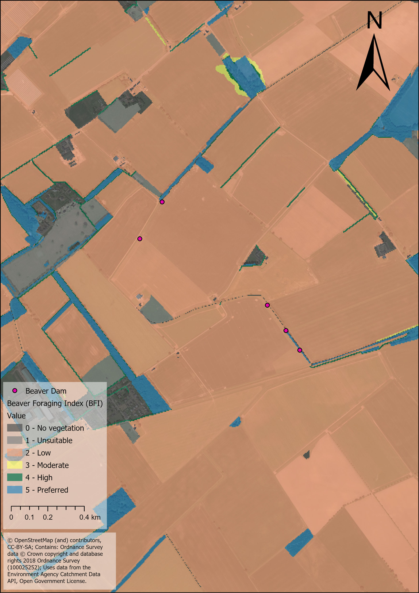
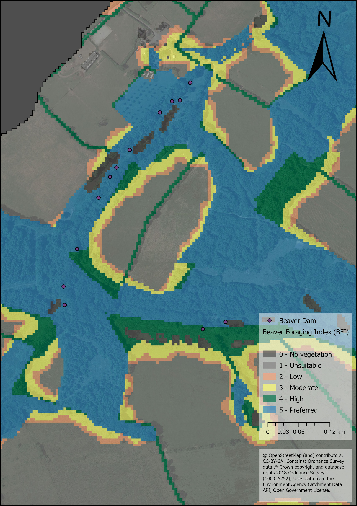

## Add a bunch of maps to give examples of BDC results at local scale

### River Otter Catchment Examples
 

#### Low intesity Agricultral Landscape 4th Order Stream.

This is the site of a beaver release in 2016. The animals have since remained in this reach and have also reproduced. The site 
composes a semi-natural grassland site with riparian woodland and encroaching willow shrub. The surrounding land is largely dominated 
by mixed grazing and arable farmland. The maximum number of dams constructed at this site, at any one time, is 10 by approximately 4 
animals. These dams frequently incur damage during high flows being either partially or fully “blown-out”. Often, following their 
destruction, the dams are then reconstructed during periods of low flow.

 

*All dams within this area have been constructed along reaches classified as pervasive or frequent. This example illustrates 
that the model effectively discriminates between those more densely wooded areas to the north of the site which offer more building 
and foraging materials than the southern part of the site where vegetation is confined to a narrower riparian strip.*

 
 

** some text here...
 

** some text here...
 
 

#### River Tay Catchment Examples

** some text here...
 

** some text here...
 
 

** some text here...
 

** some text here...
 
 

** some text here...
 

** some text here...
 
 

#### Coombeshead Sub-catchment

** some text here...
 

** some text here...
 
 
